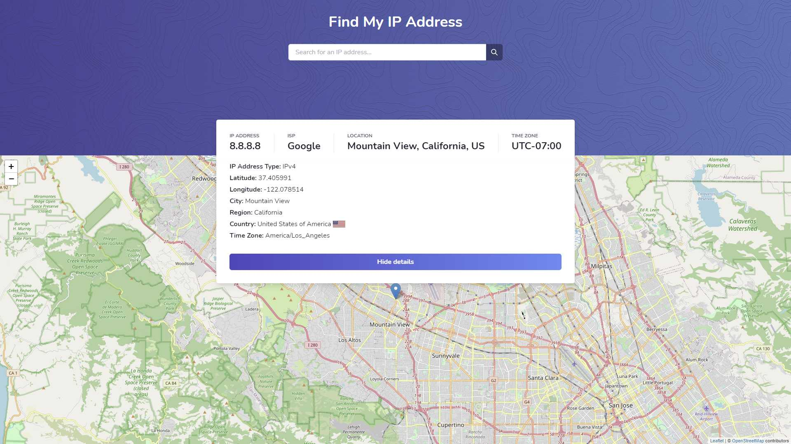

<!-- PROJECT LOGO -->
<br />
<p align="center">
  <h1 align="center">Find My IP</h3>
  <p align="center">
    A web application for finding public information regarding your IP address, including ISP, location, and time zone. 
    <br>
    View live demo at <b><a href="https://garyjx-find-my-ip.vercel.app/" target="_blank">garyjx-find-my-ip.vercel.app</a></b>.
  </p>
  
</p>

<!-- ABOUT THE PROJECT -->

## About The Project

[![Product Name Screen Shot][product-screenshot]](https://example.com)

Here's a blank template to get started:
**To avoid retyping too much info. Do a search and replace with your text editor for the following:**
`project_title`, `project_description`

### Built With

- []()
- []()
- []()

<!-- GETTING STARTED -->

## Getting Started

To get a local copy up and running follow these simple steps.

### Prerequisites

This is an example of how to list things you need to use the software and how to install them.

- npm
  ```sh
  npm install npm@latest -g
  ```

### Installation

1. Clone the repo
   ```sh
   git clone https://github.com/GaryJX/find-my-ip.git
   ```
2. Install NPM packages
   ```sh
   npm install
   ```
